<div align="center">

# 🔐 Mediroza General Hospital — Penetration Testing Project
### Black-Box Web Application Assessment | SQL Injection → Data Exfiltration → Credential Recovery → Critical Data Exposure

`NETWORKWALKS-ADEBAYO-TIMOTHY-B083-WK4-PENTEST-MEDIROZA-HOSPITAL`

</div>

<p align="center">
  
  
  
  
  
  
</p>

> ⚠️ **Authorization notice:** this engagement was conducted against a lab-provisioned target (`medirozahospital.com`) under written client authorization, as part of a controlled NetworkWalks training exercise (Batch B083, Week 4). All data shown (patient records, staff details, salaries, shareholder information) belongs to a fictitious hospital created for this exercise. These techniques must never be applied to any system without explicit written permission from the owner.

---

## 📌 Project Overview

This repository documents a full black-box penetration test against Mediroza General Hospital's public-facing web application. Over a 5-day engagement, testing progressed from passive reconnaissance through to full authentication bypass, confidential data exfiltration, offline password recovery, and discovery of a critical, unauthenticated data exposure on the server — all logged here with evidence at each step.

## 🎯 Engagement Milestones

| Milestone | Objective | Result |
|---|---|---|
| **M1 — Initial Access** | Attack the site and retrieve 3 confidential patient lab reports | ✅ Achieved via SQL injection auth bypass |
| **M2 — Data Extraction** | Crack the encryption on all 3 retrieved files | ✅ All 3 passwords recovered |
| **M3 — Critical Exposure** | Find staff salaries and shareholder details | ✅ Full HR database backup recovered |
| **M4 — Reporting** | Produce a professional penetration testing report | ✅ Full report delivered (see `/report`) |

## 🧾 Findings Summary

| Ref | Finding | Risk Rating |
|---|---|---|
| F1 | SQL Injection authentication bypass in Patient Portal login | 🔴 Critical |
| F2 | Unauthenticated directory listing exposing application file structure | 🟡 Medium |
| F3 | Verbose SQL error disclosure on login form | 🟢 Low |
| F4 | Weak / inconsistent password protection on patient lab report PDFs | 🟠 High |
| F5 | Publicly accessible legacy database backup exposing staff PII, salaries and shareholder data | 🔴 Critical |

---

# 🪜 Engagement Walkthrough

Testing followed the standard ethical-hacking phases — Reconnaissance → Scanning & Enumeration → Gaining Access → Post-Exploitation → Reporting. Each phase below is documented with the commands run and the evidence captured.

## Phase 1 — Reconnaissance

Passive information gathering began with Google dorking against the target domain to see what search engines had already indexed.

```
site:medirozahospital.com filetype:pdf
site:medirozahospital.com inurl:admin
```

No indexed PDFs or admin paths turned up — the site had minimal search-engine coverage.

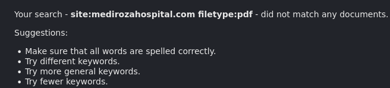

A broader keyword dork, however, surfaced a key lead: site navigation text referencing a **"Patient Portal"**.

```
site:medirozahospital.com "confidential" OR "patient" OR "lab report"
```

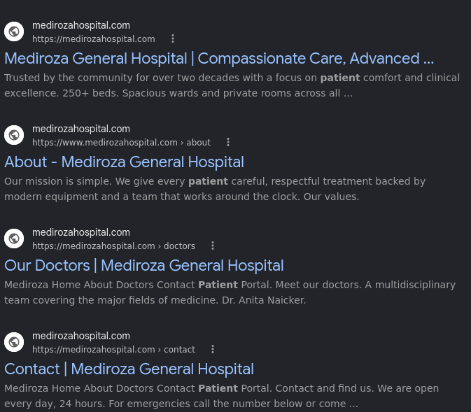

📝 **Key note:** passive recon found no files directly, but the nav breadcrumb it did surface pointed straight at the application's authentication entry point — proof that even a "no hits" dork pass is worth reviewing closely.

Following that lead to the live site located the portal itself:

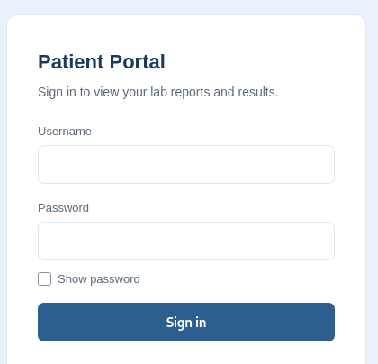

`URL: https://medirozahospital.com/patient/login.php`

## Phase 2 — Scanning & Enumeration

Network-level service enumeration was run against the host with Nmap:

```bash
nmap -sV -sC medirozahospital.com
```

<details>
<summary>📄 Nmap output (click to expand)</summary>

```
PORT    STATE  SERVICE        VERSION
21/tcp  open   ftp            Pure-FTPd
25/tcp  open   smtp?
26/tcp  open   smtp           Exim smtpd 4.100.1
53/tcp  open   domain         (generic dns response: REFUSED)
80/tcp  open   http-proxy     HAProxy http proxy 2.0.0 or later
110/tcp open   pop3           Dovecot pop3d
143/tcp open   imap           Dovecot imapd
443/tcp open   ssl/http-proxy HAProxy http proxy 2.0.0 or later
465/tcp open   ssl/smtp       Exim smtpd 4.100.1
587/tcp open   smtp           Exim smtpd 4.100.1
993/tcp open   ssl/imap       Dovecot imapd
995/tcp open   ssl/pop3       Dovecot pop3d
```
rDNS: `server274-1.web-hosting.com` — confirms shared hosting infrastructure. Mail/FTP services were fingerprinted only, not attacked, as they sit outside the authorized scope (shared hosting, not exclusive to the client).
</details>

Directory brute-forcing with Gobuster against `/patient/` uncovered a `reports/` path not linked anywhere in the UI:

```bash
gobuster dir -u https://medirozahospital.com/patient/ -w /usr/share/wordlists/dirb/common.txt
```

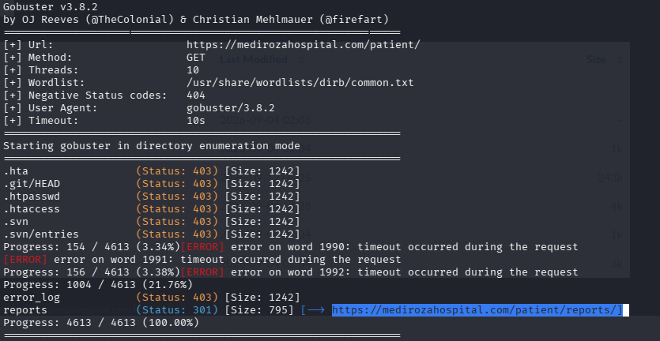

Visiting `/patient/` directly revealed directory listing was enabled — exposing the full file structure of the application:

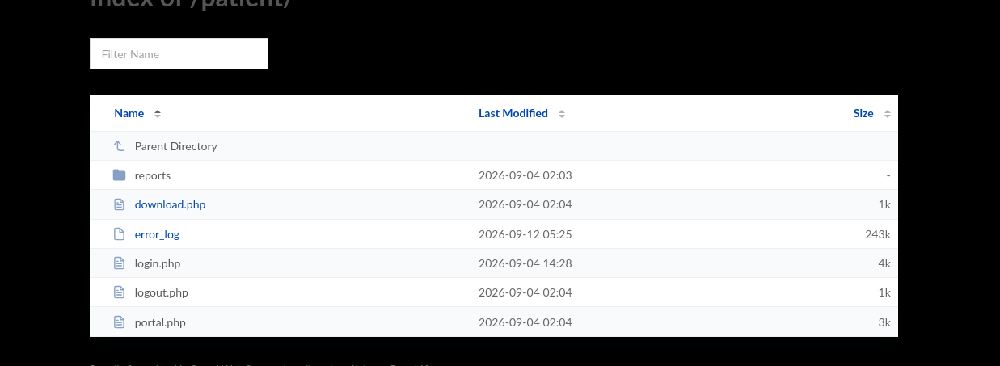

A second, root-level Gobuster pass turned up a far more significant find — a legacy `/old/` directory:

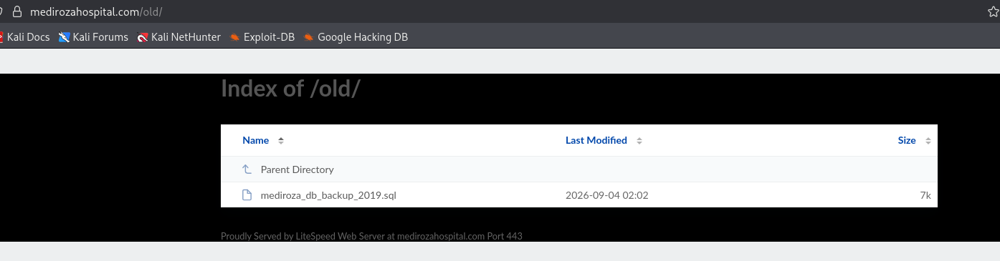

This directory contained a single file: **`mediroza_db_backup_2019.sql`** — a plaintext, unauthenticated database backup (see **Finding F5**, detailed in [Recovered Database Contents](#-recovered-database-contents-f5) below).

## Phase 3 — Gaining Access (Exploitation)

Authentication-mechanism testing on the Patient Portal began with a single-quote probe in the username field:

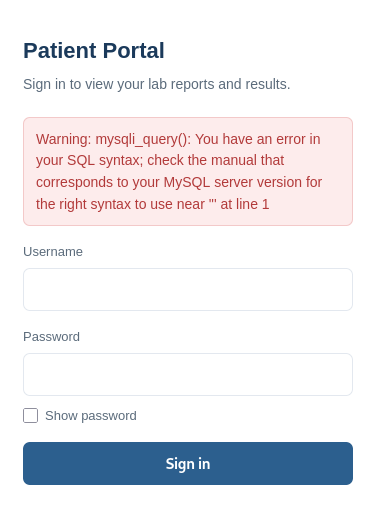

The raw `mysqli_query()` error confirmed unsanitized input was reaching the database directly — **SQL Injection (F1)**.

Testing the known account `admin` with an incorrect password returned a distinct error ("Incorrect password" vs. "username not found"), confirming **username enumeration (contributing to F1/F3)**:

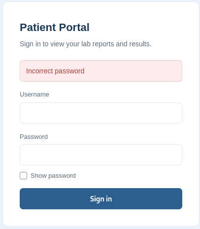

Combining both weaknesses, the following payload was submitted:

```
Username: admin'--
Password: '--
```

This bypassed authentication entirely, landing on an authenticated session with access to three confidential patient lab reports:

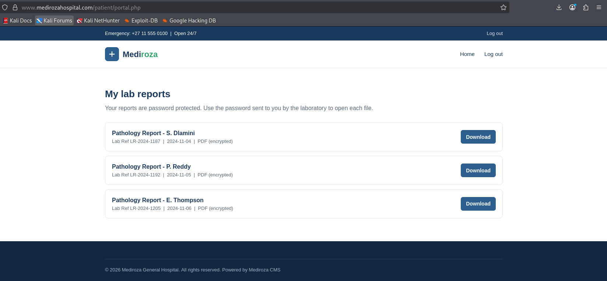

## Phase 4 — Post-Exploitation & Data Analysis

**Step 1 — Retrieve the files.** All three reports were downloaded from the compromised session, each PDF-encrypted:

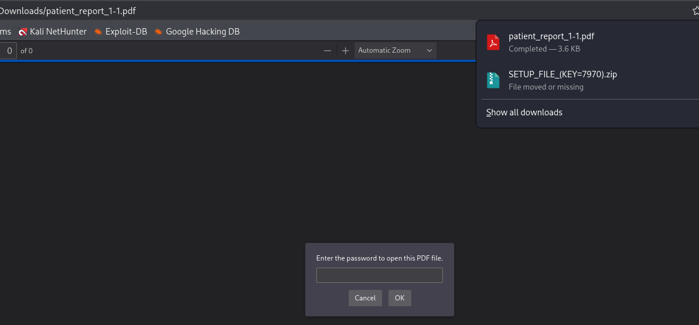
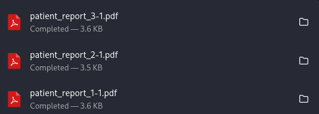

**Step 2 — Extract crackable hashes.**

```bash
pdf2john patient_report_1-1.pdf > patient_report_1-1.txt
pdf2john patient_report_2-1.pdf > patient_report_2-1.txt
pdf2john patient_report_3-1.pdf > patient_report_3-1.txt
```

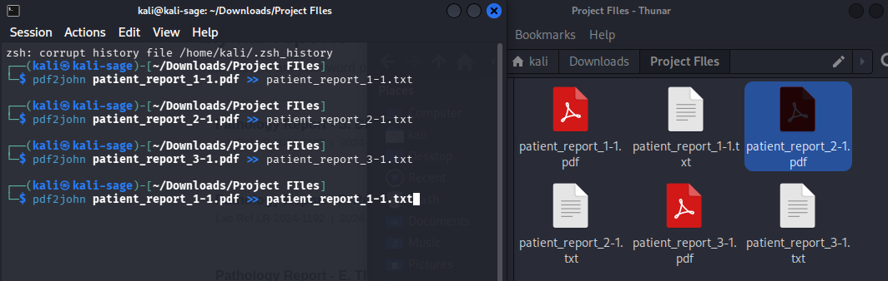
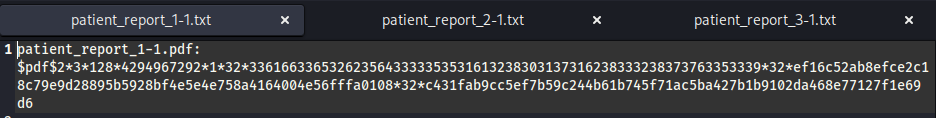
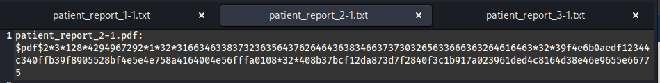

**Step 3 — Troubleshoot and crack.** A first cracking attempt failed ("No password hashes loaded") due to a stale/duplicate hash file:

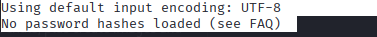

Re-verifying the clean, single-line hash file resolved it:

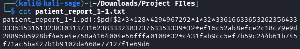

A follow-up check confirmed the `pdf` format was available in this John build:

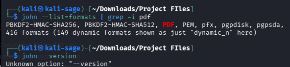

A format mismatch (auto-detect misreading the hash as an unrelated DES/tripcode format) was also caught and corrected — a reminder to always pass `--format=pdf` explicitly:

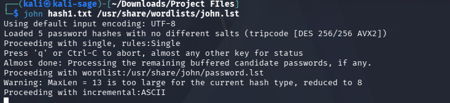

**Step 4 — Dictionary attack results (Finding F4).** All three files cracked successfully, each with a different, weak password — no consistent policy applied:

| File | Patient | Password Recovered |
|---|---|---|
| `patient_report_1-1.pdf` | S. Dlamini (LR-2024-1187) | `123456` |
| `patient_report_2-1.pdf` | P. Reddy (LR-2024-1192) | `password` |
| `patient_report_3-1.pdf` | E. Thompson (LR-2024-1205) | `!@#$%^&` |

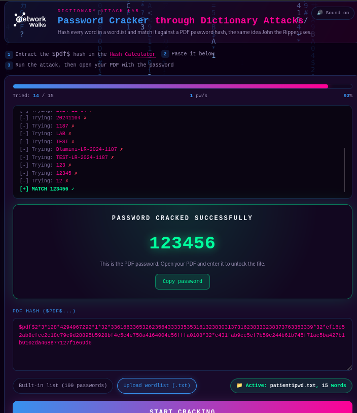
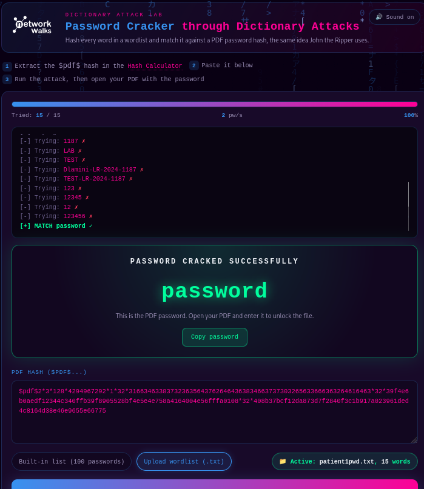
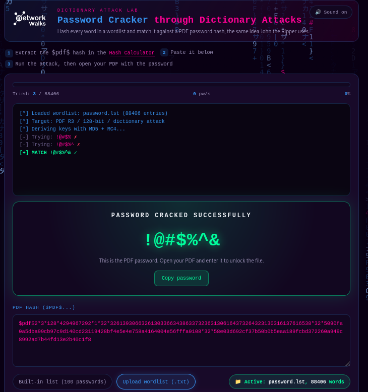

PDF metadata confirmed consistent encryption (Standard V2.3, 128-bit RC4) across all three files:

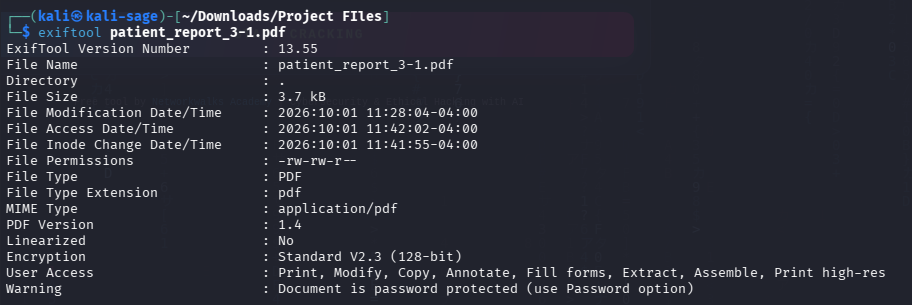

**Step 5 — Recovered patient data.** Each decrypted file exposed a full pathology report — name, date of birth, patient ID, referring doctor and diagnostic results:

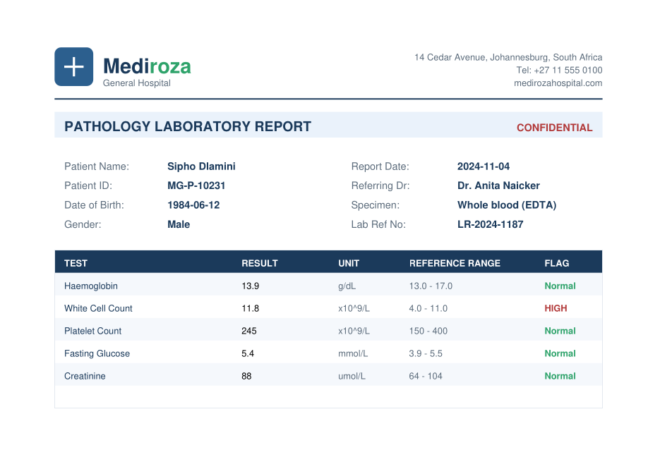
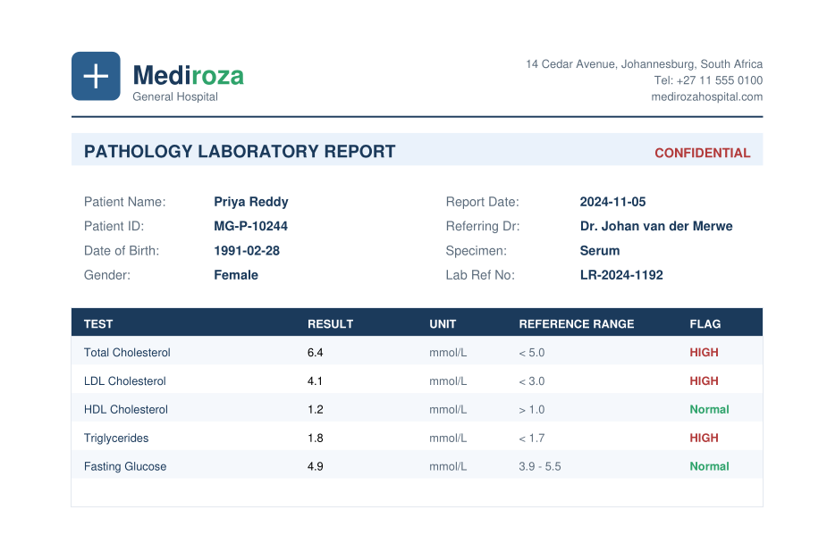
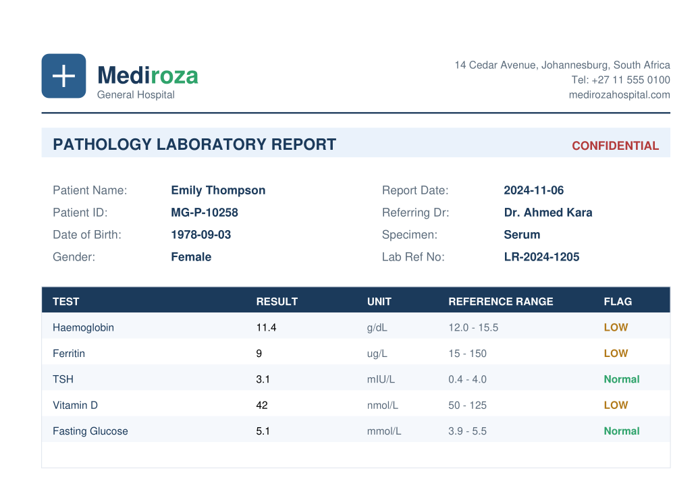

---

## 🗄️ Recovered Database Contents (F5)

The exposed `mediroza_db_backup_2019.sql` file (database: `mediroza_hr`) contained two tables, reproduced below in full as evidence of the scale of this exposure.

<details>
<summary><strong>Table 1 — Staff Records (30 of 30 recovered)</strong> — click to expand</summary>

| ID | Full Name | Job Title | Department | Monthly Salary (ZAR) | Date Joined |
|---|---|---|---|---|---|
| 1 | Dr. Rajesh Naidoo | Chief Pathologist | Diagnostics Lab | 138,000 | 2009-03-16 |
| 2 | Sarah Botha | Chief Financial Officer | Finance | 152,000 | 2011-07-01 |
| 3 | Dr. Johan van der Merwe | Medical Director | Management | 160,000 | 2007-01-22 |
| 4 | Dr. Anita Naicker | Consultant Cardiologist | Cardiology | 132,000 | 2012-09-10 |
| 5 | Dr. Ahmed Kara | Consultant Physician | Internal Medicine | 128,000 | 2013-02-18 |
| 6 | Dr. Yusuf Cassim | Senior Registrar | Emergency & Trauma | 74,000 | 2018-05-04 |
| 7 | Michael Roberts | HR Director | Human Resources | 96,000 | 2010-11-15 |
| 8 | Susan Pretorius | HR Officer | Human Resources | 32,000 | 2016-08-23 |
| 9 | Jameel Malik | IT Systems Administrator | IT | 58,000 | 2015-04-12 |
| 10 | Thabo Molefe | Network Engineer | IT | 46,000 | 2017-10-02 |
| 11 | Nomvula Khumalo | Registered Nurse | Emergency & Trauma | 34,000 | 2016-01-19 |
| 12 | Lerato Mokoena | Registered Nurse | Pediatrics | 33,000 | 2017-06-07 |
| 13 | Bongani Ndlovu | Registered Nurse | Cardiology | 35,000 | 2015-12-01 |
| 14 | Zanele Mahlangu | Nursing Sister | Theatre | 42,000 | 2013-03-25 |
| 15 | Kagiso Sithole | Pharmacist | Pharmacy | 61,000 | 2014-09-08 |
| 16 | Naledi Zulu | Pharmacy Assistant | Pharmacy | 26,000 | 2019-02-14 |
| 17 | Themba Nkosi | Radiographer | Radiology | 44,000 | 2016-07-30 |
| 18 | Palesa Radebe | Radiographer | Radiology | 43,000 | 2017-04-11 |
| 19 | Deepak Pillay | Lab Technologist | Diagnostics Lab | 41,000 | 2015-05-20 |
| 20 | Kavitha Govender | Lab Technician | Diagnostics Lab | 35,000 | 2018-08-06 |
| 21 | Dr. Suresh Moodley | Consultant Radiologist | Radiology | 130,000 | 2012-02-28 |
| 22 | Dr. Fatima Patel | Pediatrician | Pediatrics | 118,000 | 2013-10-17 |
| 23 | Nisha Singh | Physiotherapist | Rehabilitation | 48,000 | 2016-11-09 |
| 24 | Dr. Vikram Chetty | Anaesthetist | Theatre | 135,000 | 2011-06-13 |
| 25 | David Smith | Facilities Manager | Operations | 52,000 | 2014-01-27 |
| 26 | Karen O'Connor | Billing Administrator | Finance | 29,000 | 2018-03-19 |
| 27 | James Wilson | Security Supervisor | Operations | 27,000 | 2019-09-02 |
| 28 | Linda Fourie | Receptionist | Front Office | 19,000 | 2020-02-10 |
| 29 | Peter van Wyk | Procurement Officer | Supply Chain | 38,000 | 2015-08-24 |
| 30 | Andile Mbeki | Ward Clerk | Administration | 21,000 | 2019-11-05 |

> Full dataset also included email, phone and national ID fields per record — omitted above for brevity, present in the original recovered backup file.

</details>

<details open>
<summary><strong>Table 2 — Shareholder Register (10 of 10 recovered)</strong></summary>

| ID | Shareholder Name | Share % | Shares Held | Share Class |
|---|---|---|---|---|
| 1 | Dr. Rajesh Naidoo | 18.0% | 180,000 | Ordinary |
| 2 | Cedar Health Holdings (Pty) Ltd | 15.0% | 150,000 | Ordinary |
| 3 | Dr. Johan van der Merwe | 12.0% | 120,000 | Ordinary |
| 4 | Reddy Family Trust | 11.0% | 110,000 | Ordinary |
| 5 | Thabo Molefe | 10.0% | 100,000 | Ordinary |
| 6 | Sarah Botha | 9.0% | 90,000 | Ordinary |
| 7 | Dr. Ahmed Kara | 8.0% | 80,000 | Preferential |
| 8 | Naledi Zulu | 7.0% | 70,000 | Ordinary |
| 9 | Michael Roberts | 6.0% | 60,000 | Ordinary |
| 10 | Dr. Vikram Chetty | 4.0% | 40,000 | Preferential |

</details>

📝 **Key note:** this single misconfigured, forgotten `/old/` directory caused more damage than the SQLi chain above it — no exploitation skill was needed, just a guessable directory name and directory listing left switched on. A great reminder that infrastructure hygiene is as critical as application-layer security.

---

## 🧰 Tools & Techniques Used

| Tool | Phase | Purpose |
|---|---|---|
| Google Dorking | Reconnaissance | Passive discovery of indexed content, file types and paths |
| Nmap | Scanning & Enumeration | Network service/version fingerprinting |
| Gobuster | Scanning & Enumeration | Directory and file brute-forcing |
| Browser DevTools | Scanning & Exploitation | View-source / inspect-element form analysis |
| Manual SQL Injection | Exploitation | Authentication bypass via crafted login payload |
| curl | Exploitation & Verification | Direct HTTP request testing |
| pdf2john | Post-Exploitation | Hash extraction from encrypted PDFs |
| John the Ripper / Dictionary Attack | Post-Exploitation | Password recovery via targeted + generic wordlists |
| exiftool | Post-Exploitation | PDF metadata / encryption-type verification |

## 💡 What I Learned

- **A "no results" recon pass isn't a dead end** — broadening a dork's keywords rather than giving up on the file-type search is what surfaced the Patient Portal reference that kicked off the whole chain.
- **Differing login error messages are a real vulnerability on their own** — username enumeration is easy to overlook but directly assisted in confirming a valid attack target (`admin`) before the SQLi payload was even attempted.
- **Weak passwords undermine encryption that otherwise looks fine on paper** — all three PDFs used the same encryption standard, but inconsistent, lazy password choices (`123456`, `password`, and a keyboard-pattern string) made that encryption meaningless in practice.
- **Forgotten legacy files are often the highest-impact finding, not the most "technical" one** — the `/old/` directory required no exploit at all, just enabled directory listing and a guessable path, yet exposed more sensitive data than the SQL injection chain.
- **Tooling mistakes are part of the process, not a sign something's wrong** — misreading a hash format or appending to a hash file incorrectly cost time, but methodically checking file contents and format flags resolved each one without needing to restart from scratch.

## 📂 Repository Structure

```
mediroza-pentest-project/
├── README.md                  ← this file
├── report/
│   └── Mediroza_Pentest_Report.docx   ← full formal report (NetworkWalks M4 deliverable)
└── screenshots/
    └── 01–25 numbered evidence screenshots (chronological, referenced above)
```

## 🔗 Full Report

The complete, formally structured penetration testing report — including CVSS-based risk ratings, full phase-by-phase methodology, and detailed remediation guidance — is available in [`/report/Mediroza_Pentest_Report.docx`](./report/Mediroza_Pentest_Report.docx).

---

## 👤 Author

**Adebayo Timothy**
Cyber Security Analyst / Consultant

LinkedIn: *[[https://lnkd.in/p/eTRVjGsP](https://lnkd.in/p/ddadN7Bh)]*

---

## 📌 Project Information

**Program:** Cybersecurity at NetworkWalks | **Batch:** B083 | **Week:** 04 | **Project:** Penetration Testing — Mediroza General Hospital | **Engagement Type:** Black-Box Web Application Assessment
